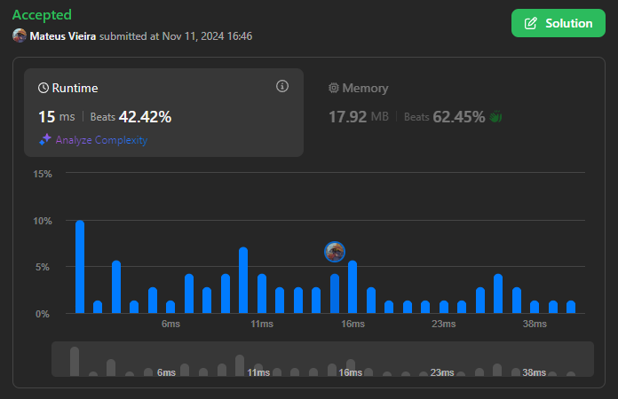
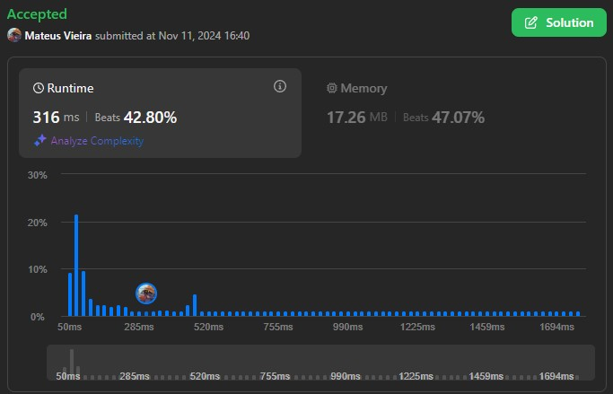
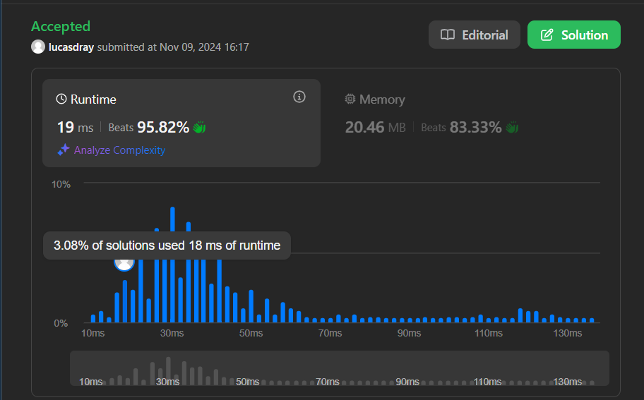
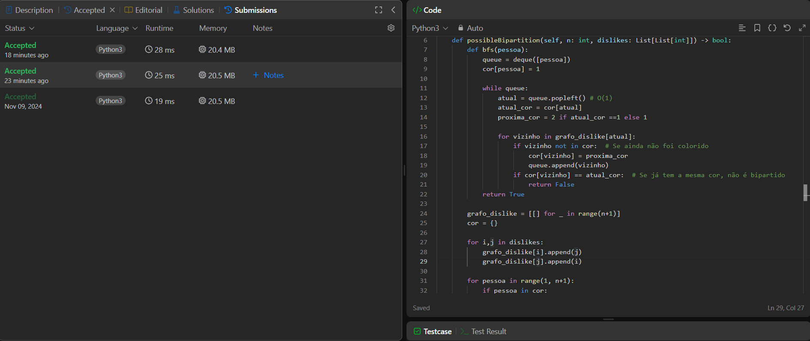
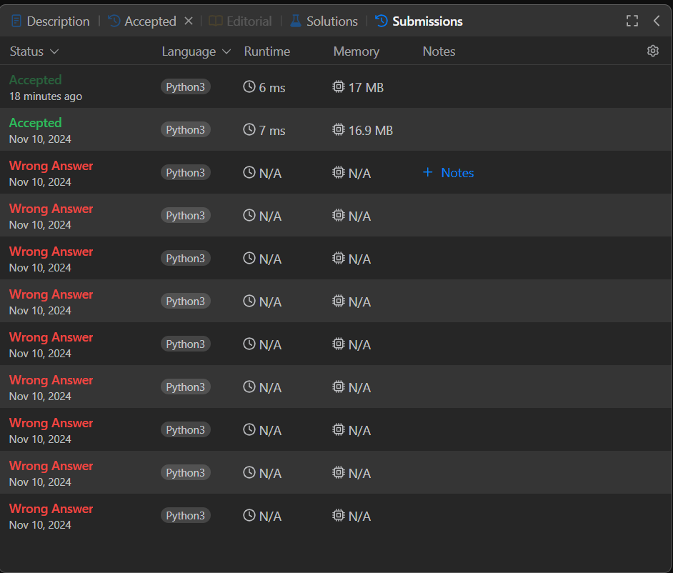
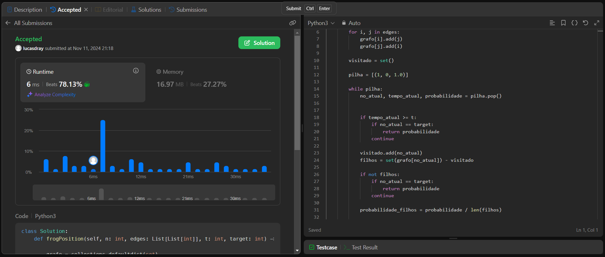

# Grafos1-LeetCode_Problems

**Número da Lista**: 1
**Conteúdo da Disciplina**: Grafos-1

## Alunos

| Matrícula | Aluno                      |
| ---------- | -------------------------- |
| 202016963  | Mateus Vinicius Vieira     |
| 211039680  | Pedro Lucas Dourado Santos |

## Sobre

Este projeto consiste na resolução de questões da plataforma LeetCode variando nas dificuldades de médio e difícil. O objetivo é utilizar o conteúdo em sala.

| Problema | Nome                                                                                                                                                                          | Nível de Dificuldade |
| -------- | ----------------------------------------------------------------------------------------------------------------------------------------------------------------------------- | -------------------- |
| 886      | [Possible Bipartition](https://leetcode.com/problems/possible-bipartition/?envType=problem-list-v2&envId=graph&difficulty=MEDIUM)                                             | Médio                |
| 1337     | [Frog Position After T Seconds](https://leetcode.com/problems/frog-position-after-t-seconds/description/?envType=problem-list-v2&envId=graph)                                 | Difícil              |
| 2924     | [Find Champion II](https://leetcode.com/problems/find-champion-ii/description/?envType=problem-list-v2&envId=graph)                                                           | Médio                |
| 3286     | [Find a Safe Walk Through a Grid](https://leetcode.com/problems/find-a-safe-walk-through-a-grid/description/?envType=problem-list-v2&envId=graph)                             | Médio                |
| 1298     | [Maximum Candies You Can Get from Boxes](https://leetcode.com/problems/maximum-candies-you-can-get-from-boxes/submissions/?envType=problem-list-v2&envId=graph&status=SOLVED) | Difícil              |

## Screenshots
### [Find Champion II](https://leetcode.com/problems/find-champion-ii/description/?envType=problem-list-v2&envId=graph)

### [Find a Safe Walk Through a Grid](https://leetcode.com/problems/find-a-safe-walk-through-a-grid/description/?envType=problem-list-v2&envId=graph)

### [Possible Bipartition](https://leetcode.com/problems/possible-bipartition/?envType=problem-list-v2&envId=graph&difficulty=MEDIUM)

### [Frog Position After T Seconds](https://leetcode.com/problems/frog-position-after-t-seconds/description/?envType=problem-list-v2&envId=graph)

### [Maximum Candies You Can Get from Boxes](https://leetcode.com/problems/maximum-candies-you-can-get-from-boxes/submissions/?envType=problem-list-v2&envId=graph&status=SOLVED)

## Linguagem Utilizada

- Python

## Uso

Entrar na plataforma [LeetCode](https://leetcode.com/), procurar pelo número do exercício, colar na aba code e clicar em Run

## Outros
[Vídeo de Apresentação](https://youtu.be/wMZ6LdrFpto)
